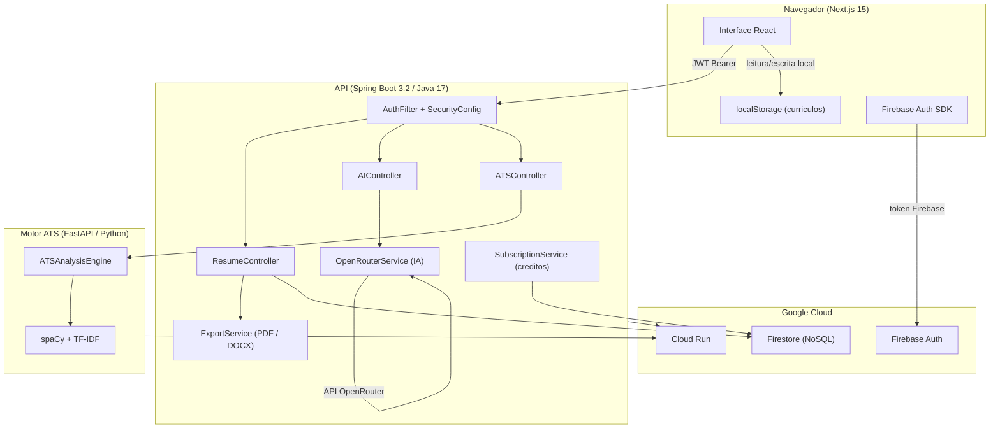

# Resuna


Plataforma completa para criacao e otimizacao de curriculos, com analise de compatibilidade ATS, revisao por inteligencia artificial, geracao de cartas de apresentacao e exportacao em PDF e DOCX.

---

## Conteudo

- [Visao geral](#visao-geral)
- [Arquitetura](#arquitetura)
- [Funcionalidades](#funcionalidades)
- [Tecnologias](#tecnologias)
- [Estrutura do projeto](#estrutura-do-projeto)
- [Requisitos](#requisitos)
- [Configuracao local](#configuracao-local)
- [Variaveis de ambiente](#variaveis-de-ambiente)
- [Testes](#testes)
- [Deploy](#deploy)
- [Seguranca](#seguranca)
- [Licenca](#licenca)

---

## Visao geral

O Resuna e um SaaS de curriculos com foco em rastreadores automatizados de candidatos (ATS). Ele oferece um editor de curriculos com preenchimento estruturado, analise de compatibilidade com vagas, sugestoes de melhoria via IA, geracao de carta de apresentacao e exportacao para PDF e DOCX — tudo a partir de um unico painel.

Os dados do usuario sao armazenados localmente no navegador (localStorage) por padrao, sem necessidade de sincronizacao com servidor para as operacoes do editor. As operacoes de IA e exportacao sao realizadas pelo backend com autenticacao obrigatoria.

---

## Arquitetura



---

## Funcionalidades

### Editor de curriculos

- Formulario estruturado com secoes: informacoes pessoais, resumo, experiencia, formacao, projetos, habilidades, certificacoes e idiomas
- Calculo de completude em tempo real
- Visualizacao de previa do PDF no editor
- Armazenamento automatico no navegador

### Exportacao

- Geracao de PDF com formatacao profissional, suporte a fontes customizadas e links clicaveis para projetos
- Exportacao para DOCX (Microsoft Word) com estilos de paragrafo e hiperlinks
- Traducao do curriculo para ingles, frances, espanhol ou japones com exportacao imediata

### Analise ATS

- Analise de compatibilidade entre o curriculo e uma descricao de vaga
- Pontuacao de 0 a 100 com detalhamento por categoria: palavras-chave, habilidades, experiencia, formacao e formatacao
- Identificacao de lacunas e palavras-chave ausentes
- Analise de PDF enviado diretamente (upload)
- Extracao de palavras-chave de uma descricao de vaga (sem consumo de creditos)

### Inteligencia artificial

- Revisao critica do curriculo com pontuacao geral, pontos fortes, pontos fracos e acoes rapidas
- Refinamento de topicos de experiencia com sugestoes especificas
- Geracao de carta de apresentacao personalizada por empresa e cargo
- Importacao de curriculo a partir de PDF existente com extracao de dados

### Creditos e planos

- Sistema de creditos diarios: 10 creditos por usuario por dia (redefinido a meia-noite UTC)
- Limite de 3 contas por endereco IP
- Sinalizadores de funcionalidades por usuario gerenciaveis pelo painel administrativo

---

## Tecnologias

### Frontend

| Tecnologia | Versao | Finalidade |
|---|---|---|
| Next.js | 15.5 | Framework React com App Router |
| React | 18.2 | Interface de usuario |
| TypeScript | 5.9 | Tipagem estatica |
| Tailwind CSS | 3.4 | Estilizacao utilitaria |
| Framer Motion | 11.0 | Animacoes |
| Lucide React | 0.300 | Icones |
| Firebase SDK | 12.8 | Autenticacao e banco de dados |
| jsPDF | 4.2 | Geracao de PDF no cliente |
| docx | 9.6 | Geracao de DOCX no cliente |
| DOMPurify | 3.3 | Sanitizacao de HTML |
| Playwright | 1.58 | Testes end-to-end |

### Backend

| Tecnologia | Versao | Finalidade |
|---|---|---|
| Spring Boot | 3.2.2 | Framework Java |
| Java | 17 | Linguagem |
| Firebase Admin SDK | 9.2 | Autenticacao e Firestore |
| Apache PDFBox | 3.0.1 | Geracao e leitura de PDF |
| Apache POI | 5.2.5 | Geracao de DOCX |
| OkHttp | 4.12 | Cliente HTTP (OpenRouter) |
| Jackson JSR310 | 3.2 | Serializacao de datas |
| Maven | 3.9 | Build e dependencias |

### Motor ATS (Python)

| Tecnologia | Versao | Finalidade |
|---|---|---|
| FastAPI | 0.109 | API HTTP |
| spaCy | 3.7 + `en_core_web_md` | NLP, reconhecimento de entidades |
| scikit-learn | 1.4 | Vetorizacao TF-IDF |
| numpy | 1.26 | Operacoes numericas |
| Pydantic | 2.5 | Validacao de dados |

### Infraestrutura

| Servico | Uso |
|---|---|
| Google Cloud Run | Hospedagem do backend e do motor ATS |
| Firebase Firestore | Banco de dados principal |
| Firebase Authentication | Login com Google OAuth |
| Cloudflare Turnstile | CAPTCHA anti-abuso nas operacoes de IA |

---

## Estrutura do projeto

```
resuna-web/
├── src/
│   ├── app/                        # Paginas (Next.js App Router)
│   │   ├── page.tsx                # Landing page
│   │   ├── login/
│   │   ├── dashboard/
│   │   ├── resumes/
│   │   │   ├── page.tsx            # Lista de curriculos
│   │   │   ├── create/             # Criacao de novo curriculo
│   │   │   ├── [id]/               # Editor dinamico
│   │   │   │   ├── page.tsx        # Editor principal
│   │   │   │   ├── analyze/        # Revisor de curriculo (IA)
│   │   │   │   └── cover-letter/   # Geracao de carta
│   │   │   └── import/pdf/         # Importacao de PDF
│   │   ├── account/
│   │   └── admin/
│   ├── components/
│   │   ├── layout/                 # Header, Footer
│   │   └── ui/                     # Button, Card, Input, Toast...
│   ├── contexts/
│   │   ├── AuthContext.tsx
│   │   └── LanguageContext.tsx
│   └── lib/
│       ├── api.ts                  # Cliente da API backend
│       ├── storage.ts              # Persistencia local (localStorage)
│       ├── completeness.ts         # Score de preenchimento do curriculo
│       ├── types.ts                # Definicoes de tipos TypeScript
│       └── firebase.ts             # Inicializacao do Firebase
├── backend/
│   ├── src/main/java/com/resuna/
│   │   ├── controller/             # Controladores REST
│   │   ├── service/                # Logica de negocio
│   │   ├── model/                  # Modelos de dados
│   │   ├── repository/             # Acesso ao Firestore
│   │   ├── config/                 # Seguranca, CORS, rate limiting
│   │   └── exception/              # Tratamento de excecoes
│   ├── ats-engine/                 # Motor ATS (FastAPI/Python)
│   │   ├── main.py
│   │   ├── requirements.txt
│   │   └── Dockerfile
│   └── pom.xml
├── tests/e2e/                      # Testes Playwright
├── public/                         # Arquivos estaticos
├── Dockerfile                      # Build do frontend
├── next.config.js
├── tailwind.config.ts
└── playwright.config.ts
```

---

## Requisitos

| Ferramenta | Versao minima |
|---|---|
| Node.js | 20 |
| Java | 17 |
| Maven | 3.9 |
| Python | 3.12 |
| Conta Firebase | Gratuita (Spark) |
| Chave OpenRouter | Gratuita em [openrouter.ai](https://openrouter.ai) |

---

## Configuracao local

### 1. Clonar o repositorio

```bash
git clone <url-do-repositorio>
cd resuna-web
```

### 2. Configurar o frontend

```bash
npm install
```

Crie o arquivo `.env.local` na raiz do projeto `resuna-web/`:

```env
NEXT_PUBLIC_API_URL=http://localhost:8080
NEXT_PUBLIC_FIREBASE_API_KEY=...
NEXT_PUBLIC_FIREBASE_AUTH_DOMAIN=...
NEXT_PUBLIC_FIREBASE_PROJECT_ID=...
NEXT_PUBLIC_FIREBASE_STORAGE_BUCKET=...
NEXT_PUBLIC_FIREBASE_MESSAGING_SENDER_ID=...
NEXT_PUBLIC_FIREBASE_APP_ID=...
NEXT_PUBLIC_TURNSTILE_SITE_KEY=      # deixe vazio para desabilitar CAPTCHA em dev
```

Inicie o servidor de desenvolvimento:

```bash
npm run dev
# Disponivel em http://localhost:3000
```

### 3. Configurar o backend

```bash
cd backend
```

Crie o arquivo `backend/.env` com base em `backend/.env.example`. Chaves obrigatorias:

```env
OPENROUTER_API_KEY=sk-or-v1-...
FIREBASE_PROJECT_ID=seu-projeto-firebase
SPRING_PROFILES_ACTIVE=dev
TURNSTILE_ENABLED=false
```

Adicione o arquivo de credenciais do Firebase Admin SDK em:
`backend/src/main/resources/firebase-admin-key.json`

Para obter o arquivo: Console Firebase > Configuracoes do projeto > Contas de servico > Gerar nova chave privada.

Inicie o backend:

```bash
mvn spring-boot:run
# API disponivel em http://localhost:8080
```

### 4. Configurar o motor ATS (opcional)

O motor ATS e utilizado apenas para analise de compatibilidade com vagas. Se nao for configurado, o backend utiliza sua propria implementacao de analise local.

```bash
cd backend/ats-engine
pip install -r requirements.txt
python -m spacy download en_core_web_md
uvicorn main:app --reload --port 8000
# Disponivel em http://localhost:8000
```

---

## Variaveis de ambiente

### Frontend (`resuna-web/.env.local`)

| Variavel | Obrigatorio | Descricao |
|---|---|---|
| `NEXT_PUBLIC_API_URL` | Sim | URL da API backend |
| `NEXT_PUBLIC_FIREBASE_API_KEY` | Sim | Chave publica do Firebase |
| `NEXT_PUBLIC_FIREBASE_AUTH_DOMAIN` | Sim | Dominio de autenticacao Firebase |
| `NEXT_PUBLIC_FIREBASE_PROJECT_ID` | Sim | ID do projeto Firebase |
| `NEXT_PUBLIC_FIREBASE_STORAGE_BUCKET` | Sim | Bucket de storage Firebase |
| `NEXT_PUBLIC_FIREBASE_MESSAGING_SENDER_ID` | Sim | ID do sender Firebase |
| `NEXT_PUBLIC_FIREBASE_APP_ID` | Sim | ID do app Firebase |
| `NEXT_PUBLIC_TURNSTILE_SITE_KEY` | Nao | Site key do Cloudflare Turnstile (CAPTCHA) |

### Backend (`backend/.env`)

| Variavel | Obrigatorio | Descricao |
|---|---|---|
| `OPENROUTER_API_KEY` | Sim | Chave da API OpenRouter para funcionalidades de IA |
| `FIREBASE_PROJECT_ID` | Sim | ID do projeto Firebase |
| `FIREBASE_CREDENTIALS_PATH` | Nao | Caminho para o JSON de credenciais (padrao: `classpath:firebase-admin-key.json`) |
| `SPRING_PROFILES_ACTIVE` | Nao | Perfil Spring: `dev` ou `prod` |
| `TURNSTILE_SECRET_KEY` | Nao | Chave secreta do Cloudflare Turnstile |
| `TURNSTILE_ENABLED` | Nao | Habilitar CAPTCHA (padrao: `true` em producao) |
| `CORS_ALLOWED_ORIGINS` | Nao | Origens permitidas para CORS |
| `INITIAL_ADMIN_EMAIL` | Nao | Email que recebera permissao de admin automaticamente |
| `CREDITS_DAILY_LIMIT` | Nao | Limite de creditos por usuario por dia (padrao: `10`) |
| `ATS_ENGINE_URL` | Nao | URL do motor ATS externo (padrao: `http://localhost:8000`) |
| `APP_DEBUG` | Nao | Exibir erros detalhados nas respostas (nao usar em producao) |

---

## Testes

### Verificacao de tipos TypeScript

```bash
npx tsc --noEmit
```

### Testes do backend (JUnit + Spring Boot Test)

```bash
cd backend
mvn test -Dspring.profiles.active=dev
# 116 testes, 0 falhas
```

### Testes end-to-end (Playwright)

```bash
# Instalar os navegadores na primeira execucao
node_modules/.bin/playwright install chromium firefox

# Executar os testes
npx playwright test --reporter=list

# Modo interativo
npx playwright test --ui
```

---

## Deploy

### Google Cloud Run (recomendado)

O projeto inclui `Dockerfile` para o frontend e `backend/Dockerfile` para o backend.

```bash
# Backend
cd backend
gcloud run deploy resuna-backend \
  --source . \
  --project SEU_PROJETO_GCP \
  --region us-central1 \
  --set-env-vars OPENROUTER_API_KEY=...,FIREBASE_PROJECT_ID=...

# Frontend
cd ..
gcloud run deploy resuna-frontend \
  --source . \
  --project SEU_PROJETO_GCP \
  --region us-central1 \
  --set-env-vars NEXT_PUBLIC_API_URL=https://resuna-backend-....run.app,...
```

### Docker local

```bash
# Frontend
docker build -t resuna-frontend .
docker run -p 3000:3000 --env-file .env.local resuna-frontend

# Backend
cd backend
docker build -t resuna-backend .
docker run -p 8080:8080 --env-file .env resuna-backend
```

---

## Seguranca

O projeto implementa as seguintes medidas de seguranca:

- Autenticacao via Firebase Auth com tokens JWT verificados pelo backend a cada requisicao
- Filtro de rate limiting por IP: 60 req/min geral, 5 req/min para endpoints de IA
- CAPTCHA obrigatorio (Cloudflare Turnstile) nas operacoes de IA
- Injecao de prompt detectada antes de enviar conteudo para a IA
- Validacao de assinatura e tamanho de arquivos PDF enviados
- CORS configurado explicitamente com lista de origens permitidas
- Headers de seguranca: HSTS, X-Content-Type-Options, X-Frame-Options, CSP
- PII anonimizado nos logs: IPs hasheados com SHA-256, emails omitidos
- URLs de projetos sanitizadas antes de renderizar em PDF/DOCX
- Confianca em `CF-Connecting-IP` restrita a requisicoes de IPs privados (proxies internos)

---

## Licenca

Distribuido sob a licenca MIT. Consulte o arquivo [LICENSE](LICENSE) para detalhes.

---

## Colaboracoes

Consulte o arquivo [COLLABORATIONS.md](COLLABORATIONS.md) para instrucoes sobre como contribuir com o projeto.
