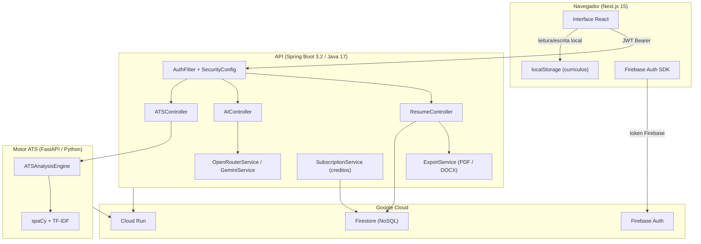

# Resuna


Editor de curriculos com IA, analise ATS e exportacao em PDF e DOCX. Gratuito e open source.

---

## Conteudo

- [Visao geral](#visao-geral)
- [Arquitetura](#arquitetura)
- [Funcionalidades](#funcionalidades)
- [Tecnologias](#tecnologias)
- [Estrutura do projeto](#estrutura-do-projeto)
- [Requisitos](#requisitos)
- [Configuracao local](#configuracao-local)
- [Variaveis de ambiente](#variaveis-de-ambiente)
- [Testes](#testes)
- [Deploy](#deploy)
- [Seguranca](#seguranca)
- [Licenca](#licenca)

---

## Visao geral

O Resuna e um editor de curriculos com foco em gerar curriculos ATS e verifica-los. Oferece formulario estruturado, analise de compatibilidade com vagas, sugestoes via IA e exportacao para PDF e DOCX.

Os curriculos sao armazenados localmente no navegador (localStorage). As operacoes de IA e exportacao passam pelo backend com autenticacao obrigatoria.

---

## Arquitetura



---

## Funcionalidades

### Editor de curriculos

- Formulario estruturado: informacoes pessoais, resumo, experiencia, formacao, projetos, habilidades, certificacoes e idiomas
- Calculo de completude em tempo real
- Armazenamento automatico no navegador, isolado por conta de usuario

### Exportacao

- PDF com formatacao profissional, fontes customizadas e links clicaveis
- DOCX (Microsoft Word) com estilos de paragrafo e hiperlinks
- Traducao do curriculo de portugues para ingles com exportacao imediata

### Analise ATS

- Pontuacao de 0 a 100 com detalhamento por categoria: palavras-chave, habilidades, experiencia, formacao e formatacao
- Identificacao de lacunas e palavras-chave ausentes
- Analise de PDF enviado diretamente (upload)
- Extracao de palavras-chave de uma descricao de vaga (sem consumo de creditos)

### Inteligencia artificial

- Revisao critica do curriculo com pontos fortes, pontos fracos e sugestoes rapidas
- Refinamento de topicos de experiencia com sugestoes especificas
- Importacao de curriculo a partir de PDF existente

### Creditos

- 5 creditos de IA por usuario por dia, renovados a meia-noite no horario de Brasilia
- Controle de abuso por IP e fingerprint na criacao de contas

---

## Tecnologias

### Frontend

| Tecnologia | Versao | Finalidade |
|---|---|---|
| Next.js | 15.5 | Framework React com App Router |
| React | 18.2 | Interface de usuario |
| TypeScript | 5.9 | Tipagem estatica |
| Tailwind CSS | 3.4 | Estilizacao |
| Framer Motion | 11.0 | Animacoes |
| Firebase SDK | 12.8 | Autenticacao |
| Playwright | 1.58 | Testes end-to-end |

### Backend

| Tecnologia | Versao | Finalidade |
|---|---|---|
| Spring Boot | 3.2.2 | Framework Java |
| Java | 17 | Linguagem |
| Firebase Admin SDK | 9.2 | Autenticacao e Firestore |
| Apache PDFBox | 3.0.1 | Geracao e leitura de PDF |
| Apache POI | 5.2.5 | Geracao de DOCX |
| OkHttp | 4.12 | Cliente HTTP (OpenRouter / Gemini) |
| Maven | 3.9 | Build e dependencias |

### Motor ATS (Python)

| Tecnologia | Versao | Finalidade |
|---|---|---|
| FastAPI | 0.109 | API HTTP |
| spaCy | 3.7 + `en_core_web_md` | NLP, reconhecimento de entidades |
| scikit-learn | 1.4 | Vetorizacao TF-IDF |
| numpy | 1.26 | Operacoes numericas |
| Pydantic | 2.5 | Validacao de dados |

### Infraestrutura

| Servico | Uso |
|---|---|
| Google Cloud Run | Hospedagem do backend e do motor ATS |
| Firebase Firestore | Banco de dados |
| Firebase Authentication | Login com Google OAuth |
| Cloudflare Turnstile | CAPTCHA anti-abuso nas operacoes de IA |

---

## Estrutura do projeto

```
resuna-web/
├── src/
│   ├── app/                        # Paginas (Next.js App Router)
│   │   ├── page.tsx                # Landing page
│   │   ├── login/
│   │   ├── resumes/
│   │   │   ├── page.tsx            # Lista de curriculos
│   │   │   ├── create/             # Criacao de novo curriculo
│   │   │   ├── [id]/               # Editor dinamico
│   │   │   │   ├── page.tsx        # Editor principal
│   │   │   │   ├── analyze/        # Revisor de curriculo (IA)
│   │   │   └── import/pdf/         # Importacao de PDF
│   │   ├── account/
│   │   └── admin/
│   ├── components/
│   │   ├── layout/                 # Header
│   │   └── ui/                     # Button, Card, Input, Toast...
│   ├── contexts/
│   │   ├── AuthContext.tsx
│   │   └── LanguageContext.tsx
│   └── lib/
│       ├── api.ts                  # Cliente da API backend
│       ├── storage.ts              # Persistencia local (localStorage)
│       ├── completeness.ts         # Score de preenchimento
│       ├── types.ts                # Tipos TypeScript
│       └── firebase.ts             # Inicializacao do Firebase
├── backend/
│   ├── src/main/java/com/resuna/
│   │   ├── controller/             # Controladores REST
│   │   ├── service/                # Logica de negocio
│   │   ├── model/                  # Modelos de dados
│   │   ├── repository/             # Acesso ao Firestore
│   │   ├── config/                 # Seguranca, CORS, rate limiting
│   │   └── exception/              # Tratamento de excecoes
│   ├── ats-engine/                 # Motor ATS (FastAPI/Python)
│   │   ├── main.py
│   │   ├── requirements.txt
│   │   └── Dockerfile
│   └── pom.xml
├── tests/e2e/                      # Testes Playwright
├── public/
├── Dockerfile
├── next.config.js
└── playwright.config.ts
```

---

## Requisitos

| Ferramenta | Versao minima |
|---|---|
| Node.js | 20 |
| Java | 17 |
| Maven | 3.9 |
| Python | 3.12 |
| Conta Firebase | Gratuita (Spark) |
| Chave OpenRouter | Gratuita em [openrouter.ai](https://openrouter.ai) |

---

## Configuracao local

### 1. Clonar o repositorio

```bash
git clone https://github.com/LirielC/resuna-web.git
cd resuna-web/resuna-web
```

### 2. Configurar o frontend

```bash
npm install
```

Crie o arquivo `.env.local` na pasta `resuna-web/`:

```env
NEXT_PUBLIC_API_URL=http://localhost:8080
NEXT_PUBLIC_FIREBASE_API_KEY=...
NEXT_PUBLIC_FIREBASE_AUTH_DOMAIN=...
NEXT_PUBLIC_FIREBASE_PROJECT_ID=...
NEXT_PUBLIC_FIREBASE_STORAGE_BUCKET=...
NEXT_PUBLIC_FIREBASE_MESSAGING_SENDER_ID=...
NEXT_PUBLIC_FIREBASE_APP_ID=...
NEXT_PUBLIC_TURNSTILE_SITE_KEY=      # deixe vazio para desabilitar CAPTCHA em dev
```

```bash
npm run dev
# Disponivel em http://localhost:3000
```

### 3. Configurar o backend

```bash
cd backend
```

Adicione o arquivo de credenciais do Firebase Admin SDK em:
`backend/src/main/resources/firebase-admin-key.json`

Para obter o arquivo: Console Firebase > Configuracoes do projeto > Contas de servico > Gerar nova chave privada.

Configure as variaveis de ambiente (veja secao abaixo) e inicie:

```bash
mvn spring-boot:run -Dspring-boot.run.profiles=dev
# API disponivel em http://localhost:8080
```

### 4. Configurar o motor ATS (opcional)

O motor ATS e utilizado apenas para analise de compatibilidade com vagas. Se nao for configurado, o backend usa uma implementacao local de fallback.

```bash
cd backend/ats-engine
pip install -r requirements.txt
python -m spacy download en_core_web_md
uvicorn main:app --reload --port 8000
```

---

## Variaveis de ambiente

### Frontend (`resuna-web/.env.local`)

| Variavel | Obrigatorio | Descricao |
|---|---|---|
| `NEXT_PUBLIC_API_URL` | Sim | URL da API backend |
| `NEXT_PUBLIC_FIREBASE_API_KEY` | Sim | Chave publica do Firebase |
| `NEXT_PUBLIC_FIREBASE_AUTH_DOMAIN` | Sim | Dominio de autenticacao Firebase |
| `NEXT_PUBLIC_FIREBASE_PROJECT_ID` | Sim | ID do projeto Firebase |
| `NEXT_PUBLIC_FIREBASE_STORAGE_BUCKET` | Sim | Bucket de storage Firebase |
| `NEXT_PUBLIC_FIREBASE_MESSAGING_SENDER_ID` | Sim | ID do sender Firebase |
| `NEXT_PUBLIC_FIREBASE_APP_ID` | Sim | ID do app Firebase |
| `NEXT_PUBLIC_TURNSTILE_SITE_KEY` | Nao | Site key do Cloudflare Turnstile |

### Backend

| Variavel | Obrigatorio | Descricao |
|---|---|---|
| `OPENROUTER_API_KEY` | Sim | Chave da API OpenRouter |
| `GEMINI_API_KEY` | Nao | Chave da API Gemini (preferida para traducao) |
| `FIREBASE_PROJECT_ID` | Sim | ID do projeto Firebase |
| `FIREBASE_CREDENTIALS_PATH` | Nao | Caminho para o JSON de credenciais |
| `SPRING_PROFILES_ACTIVE` | Nao | Perfil Spring: `dev` ou `prod` |
| `TURNSTILE_SECRET_KEY` | Nao | Chave secreta do Cloudflare Turnstile |
| `TURNSTILE_ENABLED` | Nao | Habilitar CAPTCHA (padrao: `true`) |
| `CORS_ALLOWED_ORIGINS` | Nao | Origens permitidas para CORS |
| `INITIAL_ADMIN_EMAIL` | Nao | Email que recebera permissao de admin automaticamente |
| `ATS_ENGINE_URL` | Nao | URL do motor ATS externo (padrao: `http://localhost:8000`) |

---

## Testes

### Verificacao de tipos TypeScript

```bash
npx tsc --noEmit
```

### Testes do backend (JUnit)

```bash
cd resuna-web/backend
mvn test -Dspring.profiles.active=dev
# 135 testes, 0 falhas
```

### Testes end-to-end (Playwright)

```bash
# Instalar os navegadores na primeira execucao
node_modules/.bin/playwright install chromium firefox

npx playwright test --reporter=list
```

---

## Deploy

O projeto inclui `Dockerfile` para o frontend e `backend/Dockerfile` para o backend. O script `deploy.sh` na raiz automatiza o build e o deploy para o Google Cloud Run.

```bash
# Deploy completo (backend + frontend)
bash deploy.sh
```

Para deploy manual:

```bash
# Backend
cd resuna-web/backend
gcloud run deploy resuna-backend \
  --source . \
  --project SEU_PROJETO_GCP \
  --region us-central1

# Frontend
cd resuna-web
gcloud run deploy resuna-frontend \
  --source . \
  --project SEU_PROJETO_GCP \
  --region us-central1 \
  --set-env-vars API_URL=https://resuna-backend-....run.app
```

---

## Seguranca

- Autenticacao via Firebase Auth com tokens JWT verificados a cada requisicao
- Isolamento de dados por usuario: cada curriculo e vinculado a um `userId` verificado no backend
- Rate limiting por IP: 60 req/min geral, 5 req/min para endpoints de IA
- CAPTCHA obrigatorio (Cloudflare Turnstile) nas operacoes de IA
- Firestore com deny-by-default: clientes nao tem acesso direto aos dados de outros usuarios
- Headers de seguranca: HSTS, CSP, X-Content-Type-Options, X-Frame-Options
- IPs anonimizados nos logs (SHA-256), emails omitidos de telemetria
- URLs sanitizadas antes de renderizar em PDF/DOCX

Para relatar uma vulnerabilidade, consulte [SECURITY.md](resuna-web/SECURITY.md).

---

## Licenca

Distribuido sob a licenca MIT. Consulte o arquivo [LICENSE](LICENSE) para detalhes.
