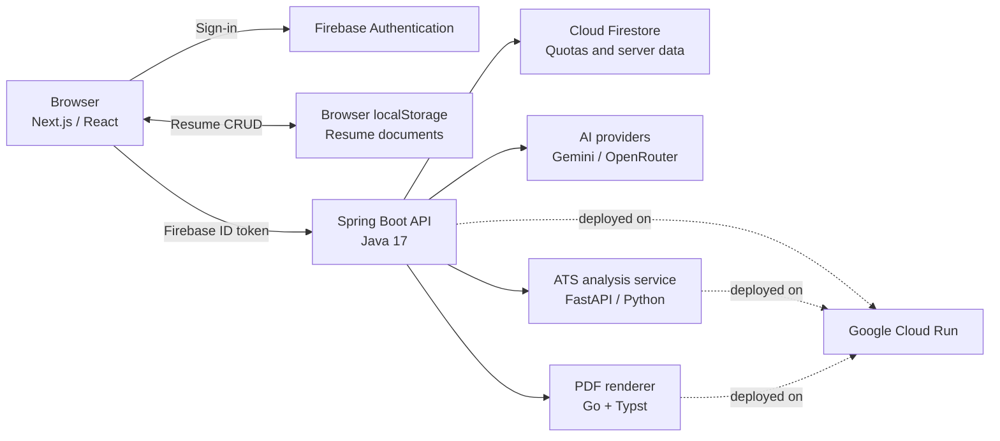

# Resuna

<p align="center">
  <strong>An open-source, ATS-focused resume editor.</strong><br />
  Create structured resumes, compare them with job descriptions, translate them, and export clean documents.
</p>

<p align="center">
  
  
  
  
  
  
</p>

## Overview

Resuna helps people create readable, ATS-oriented resumes and tailor them to a job opportunity. The editor offers both a guided visual form and a JSONC source editor, with a live preview. Resume content is stored in the browser; authenticated backend services provide AI features, ATS analysis, quotas, and document rendering.

All resume templates are designed for linear reading: one column, conventional sections, no profile photos, and no decorative layout elements in the exported resume.

## Features

- **Visual and JSONC editing** with a shared resume document and live preview.
- **ATS analysis** that compares an uploaded PDF and a job description, returning a score, matching terms, gaps, and suggestions.
- **AI assistance** for resume critique, bullet refinement, PDF import, and Portuguese-to-English translation.
- **Document exports** as PDF and DOCX; PDF rendering is available through the Java service and the Go/Typst renderer.
- **Three ATS-oriented themes:** Classic, Modern, and Compact. They vary typography and spacing, not the single-column reading order.
- **Daily account limits:** up to five resume creations and four resume translations per user per UTC day.
- **Two-page PDF limit:** generated resume PDFs exceeding two pages are rejected.
- **Free and open source:** there are no paid plans in the product.

## Architecture


```mermaid
flowchart LR
    Browser["Browser\nNext.js / React"]
    Auth["Firebase Authentication"]
    Local["Browser localStorage\nResume documents"]
    API["Spring Boot API\nJava 17"]
    Firestore["Cloud Firestore\nQuotas and server data"]
    AI["AI providers\nGemini / OpenRouter"]
    ATS["ATS analysis service\nFastAPI / Python"]
    Typst["PDF renderer\nGo + Typst"]
    Run["Google Cloud Run"]

    Browser -->|Sign-in| Auth
    Browser <--> |Resume CRUD| Local
    Browser -->|Firebase ID token| API
    API --> Firestore
    API --> AI
    API --> ATS
    API --> Typst
    API -. deployed on .-> Run
    ATS -. deployed on .-> Run
    Typst -. deployed on .-> Run
```

### Request and data flow

1. The Next.js application renders the editor, resume library, ATS upload flow, and preview.
2. Resume drafts are persisted in the user's browser using `localStorage`; the frontend obtains a Firebase ID token for protected operations.
3. The Spring Boot API verifies authenticated requests and coordinates AI, ATS analysis, exports, and per-user daily quotas.
4. The Python service performs job-description/resume analysis. The Java service can also provide a local ATS fallback if the separate engine is not configured.
5. The Go service accepts resume data and a theme, renders Typst templates, and returns a PDF.
6. Cloud Run hosts the backend services. Firebase Authentication handles sign-in, and Firestore stores server-side data such as daily quota records.

## Technology stack

| Area | Technologies | Purpose |
| --- | --- | --- |
| Web application | Next.js 15, React 18, TypeScript 5.9 | App Router, UI, and typed client logic |
| Styling and interaction | Tailwind CSS 3, Framer Motion, Lucide | Styling, animation, and icons |
| Resume editor | CodeMirror 6, `jsonc-parser` | JSONC editing, syntax support, and parsing |
| Client authentication | Firebase JavaScript SDK | Google sign-in and Firebase ID tokens |
| Java API | Java 17, Spring Boot 3.2, Maven | Authenticated REST API and business logic |
| Firebase server SDK | Firebase Admin SDK, Cloud Firestore | Token verification and server-side persistence |
| PDF and Word documents | Apache PDFBox, Apache POI | PDF processing/rendering and DOCX generation |
| ATS engine | Python 3.11, FastAPI, spaCy, scikit-learn, NumPy, Pydantic | HTTP analysis service, NLP, and TF-IDF features |
| Typst renderer | Go 1.22, Typst | Lightweight rendering service and PDF templates |
| AI integrations | Gemini and OpenRouter integrations | Resume critique, refinement, and translation |
| Deployment | Docker, Google Cloud Build, Google Cloud Run | Container builds and managed service hosting |
| Testing | TypeScript compiler, JUnit 5 / Spring Test, Playwright | Type checks, backend tests, and browser tests |

Exact dependency versions are maintained in `resuna-web/package.json`, `resuna-web/backend/pom.xml`, `resuna-web/backend/ats-engine/requirements.txt`, and `resuna-web/renderer/go.mod`.

## Repository layout

```text
resuna-web/
├── src/
│   ├── app/                 # Next.js routes and pages
│   ├── components/          # UI, editor, resume preview, and layout
│   ├── contexts/            # Authentication and language contexts
│   ├── hooks/               # Editor and integration hooks
│   └── lib/                 # API client, Firebase, types, storage, JSONC
├── backend/
│   ├── src/main/java/       # Spring Boot API, controllers, services
│   ├── src/test/java/       # Backend unit and integration tests
│   └── ats-engine/          # Python/FastAPI ATS analysis service
├── renderer/                # Go HTTP service and Typst templates
├── tests/e2e/               # Playwright end-to-end tests
├── Dockerfile               # Frontend container
└── cloudbuild-frontend.yaml # Frontend Cloud Build configuration
```

## Getting started

### Prerequisites

- Node.js 20 or later and npm
- Java 17 and Maven 3.9 or later
- Python 3.11 for the ATS service
- Go 1.22 and the Typst CLI for local renderer development
- A Firebase project for authentication and backend integration

### 1. Clone and install the frontend

```bash
git clone https://github.com/LirielC/resuna-web.git
cd resuna-web/resuna-web
npm ci
```

Create `.env.local` in the `resuna-web/` app directory with the Firebase **web app** configuration. `API_URL` configures the server-side Next.js API proxy; it is not exposed to the browser. Never put service-account private keys in frontend variables.

```dotenv
API_URL=http://localhost:8080
NEXT_PUBLIC_FIREBASE_API_KEY=your-firebase-web-api-key
NEXT_PUBLIC_FIREBASE_AUTH_DOMAIN=your-project.firebaseapp.com
NEXT_PUBLIC_FIREBASE_PROJECT_ID=your-project-id
NEXT_PUBLIC_FIREBASE_STORAGE_BUCKET=your-project.appspot.com
NEXT_PUBLIC_FIREBASE_MESSAGING_SENDER_ID=your-sender-id
NEXT_PUBLIC_FIREBASE_APP_ID=your-web-app-id
NEXT_PUBLIC_TURNSTILE_SITE_KEY=
```

Start the web application:

```bash
npm run dev
```

Open <http://localhost:3000>.

### 2. Run the Java API

Configure Firebase Admin credentials using Application Default Credentials or the backend's supported credential configuration. Set the required provider/project settings for the features you want to run; keep private keys and AI provider keys outside the repository.

```bash
cd backend
mvn spring-boot:run
```

The API listens on <http://localhost:8080> by default. See `backend/src/main/resources/application.yml` and `application-prod.yml` for the configuration names and defaults used by the service.

### 3. Run the ATS engine (optional)

The Java API has a local analysis fallback; run the separate Python service when you want to develop or test the standalone engine.

```bash
cd backend/ats-engine
python -m venv .venv
# Activate .venv for your shell, then:
pip install -r requirements.txt
python -m spacy download en_core_web_md
uvicorn main:app --reload --port 8000
```

Configure the Java API's ATS engine URL to point to `http://localhost:8000` when using the standalone service.

### 4. Run the Typst renderer (optional)

```bash
cd renderer
go run .
```

The renderer uses the templates under `renderer/templates`. For containerized builds, its Dockerfile includes the Go build stage and Typst runtime image.

## Configuration and secrets

- Frontend configuration is read from `resuna-web/.env.local`; `NEXT_PUBLIC_*` values are bundled into client assets and must contain only browser-safe configuration.
- Backend credentials (Firebase Admin, AI provider, Turnstile secret) must be provided through local environment/ADC or a managed secret store in production.
- Do not commit `.env` files, service-account JSON, private keys, or production secrets. The repository `.gitignore` excludes common credential files.
- Cloud Run services use separate configuration for the web app, Java API, ATS engine, and Typst renderer. Follow the checked-in Dockerfiles and Cloud Build configuration for the relevant component.

## Development checks

Frontend type checking:

```bash
cd resuna-web
npm run typecheck
```

Frontend production build:

```bash
npm run build
```

Backend tests:

```bash
cd resuna-web/backend
mvn test
```

End-to-end tests:

```bash
cd resuna-web
npx playwright install chromium
npm run test:e2e
```

The ATS service also includes `backend/ats-engine/test_analysis.py` for engine-level checks.

## Deployment

The application is designed to run as separate containers on Google Cloud Run. The repository includes Dockerfiles for the frontend, Java API, Python ATS engine, and Go/Typst renderer. The frontend also has a Cloud Build configuration in `resuna-web/cloudbuild-frontend.yaml`.

Deploy components independently so each service keeps its own runtime configuration and secrets. For example, deploy the Java API from `resuna-web/backend`:

```bash
gcloud run deploy resuna-backend \
  --source . \
  --project YOUR_GCP_PROJECT_ID \
  --region YOUR_REGION
```

Before deploying the frontend, provide its public Firebase web configuration to the build. Configure backend-only secrets through Cloud Run/Secret Manager, not Docker build arguments or committed files. Refer to Google Cloud's deployment guidance and the checked-in build files for the service-specific commands.

## Security

- Protected API operations use Firebase authentication and server-side token verification.
- Per-user daily quotas are enforced by the backend; browser-side checks are not the security boundary.
- Uploaded PDFs and generated PDFs are handled by backend services, with generated resume PDFs limited to two pages.
- Configure CORS, Turnstile, rate limits, and provider credentials for the production environment.
- Do not include personal resume data, credentials, or generated production artifacts in issues or pull requests.

Please report vulnerabilities privately using the contact details in [`resuna-web/SECURITY.md`](resuna-web/SECURITY.md), when available, rather than opening a public issue with exploit details.

## Contributing

Bug reports and pull requests are welcome. For changes that affect resume parsing, ATS output, exports, or authentication, include tests and describe the behavior you verified. Never submit real personal resumes or secrets as fixtures.

## License

Resuna is distributed under the MIT License. See [`LICENSE`](LICENSE).
